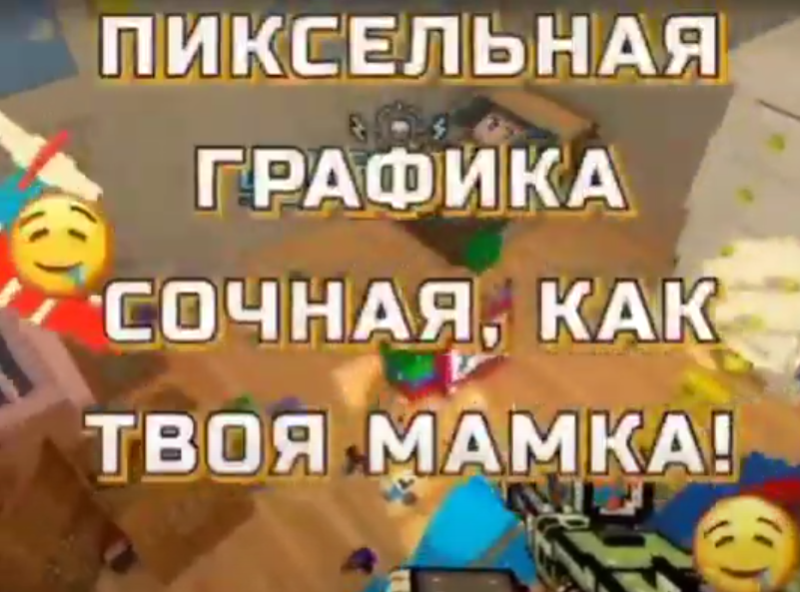
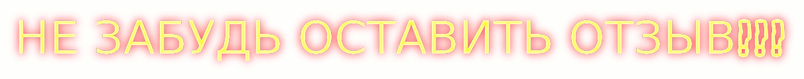

<!DOCTYPE html>
<html lang="en">
<html>
   <head>
      <meta charset="UTF-8">
      
     <h2> "https://xxnagibatorx1337x.github.io/main.html" </h2>
   </head>
   <body>
	
	
     

      

     <h3 class = "text" background-color: #000000 >BEST OLD ROLBOX EREVIVAL LAUMNCHER</h3>
	   
       <button class="btn" id="send_presence">Download launcher</button>
	
	<frame>
	  <section>
		  
		  
		  
		 <h4>ОТЗЫВЫ</h4>
		  
		   <h2>vasyageymer2012
		                             -ХАРОШИЙ ЛАУНЧИР!
		  </h2>
		  <h2>D0WN1337
		                             -very good lau ncher !! rcomended
		  </h2>
		 
		  <h2>xx МУЖИГ xx
		                             -крута ставлю 45 звезд!
		  </h2>
		  
		   <h2>Syper мачо men
		                             -клас всем сааветую 👍👍👍
		  </h2>
		  
		   <h2>fart2shit
		                             -muy buen programa excelente!!! aconsejo a todos
		  </h2>
		  
		   <h2>~=КАЧЁК!В`АДИДОДАСЕ`=-
		                             -КЛАССНО И ИЩО ЕТА ЕНЕ ВИРВС ПАЭТОМУ СКЕААЧПАИВАЙТЕ😀😀😀😀😀
		  </h2>
		  
		  
	   </section>
	     
	 
       
      
      
      
      </script>
   </body>
</html>
